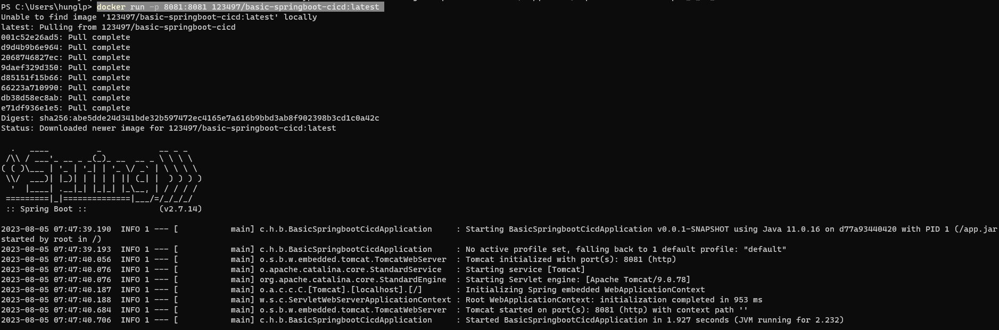

# Build CI/CD SpringBoot Project

[//]: # (### 1. Install Gitlab Runner)

[//]: # (- Tải gitlab runner cho windows ở link sau : https://docs.gitlab.com/runner/install/windows.html _&#40;_Phải để file này trong thư mục C:/Gitlab-Runner&#41;__)

[//]: # (- Đổi tên file thành gitlab-runner.exe)

[//]: # (- `cd C:\Gitlab-Runner`)

[//]: # (- Install gitlab runner: `gitlab-runner.exe install`)

[//]: # (- Start gitlab runner : `gitlab-runner.exe start`)

[//]: # (- Kiểm tra version Gitlab runner : `gitlab-runner --version`)

[//]: # (    + Kết quả:)

[//]: # (    + ![2.jpg]&#40;img_guide/2.jpg&#41;)

### 1. Install Gitlab Runner)
  - Chạy script sau để run gitlab runner trên docker : 
  - `docker run -d --name gitlab-runner --restart always -v /srv/gitlab-runner/config:/etc/gitlab-runner -v /var/run/docker.sock:/var/run/docker.sock  gitlab/gitlab-runner:v15.8.2`
  - Kết quả :
     + 
  - Chạy lệnh restart Gitlab Runner :` docker restart gitlab-runner `(gitlab-runner đang là tên của container ở hình trên)

### 2. Đăng kí Gitlab Runner:
- Lấy Registration Token ở đây: 
  + 
- Đăng kí runner: `docker exec -it gitlab-runner gitlab-runner register`
  + Nhập Gitlab instance URL: https://gitlab.com/
  + Nhập token vừa lấy được ở trên
  + Nhập giá trị "Enter an executor" là : _docker_
  + Nhập giá trị "Default images" là "_debian:latest_"
  + 
  + 
- Active runner job:
  + 
  + 

### 3. Cấu hình Gilab-ci
  - Tạo file gitlab-ci.yml rồi config như sau:
  - 
### 4. Chạy thử dưới local:
  - `docker run -p 8081:8081 123497/basic-springboot-cicd:latest`
  - Kết quả:
    + 
    + 
    + 
