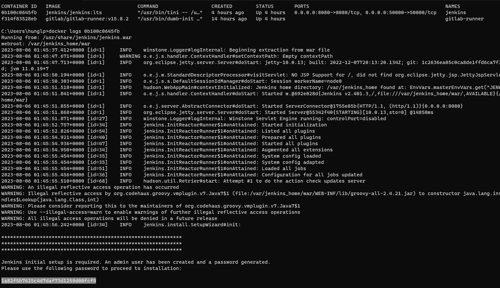
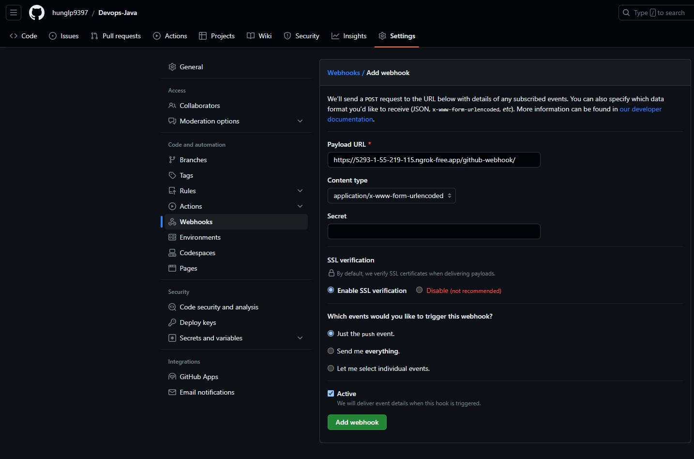
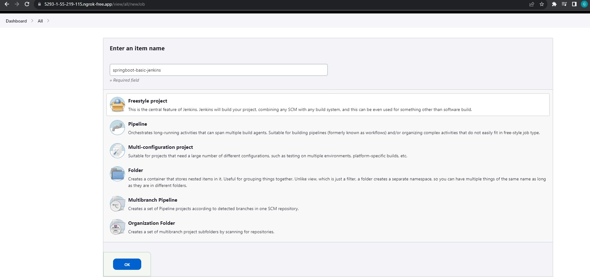

# CI/CD SpringBoot project tích hợp Jenkins

## 1. Cài đặt jenkins(Trên docker)
   - `docker run -d --name jenkins -p 8080:8080 -p 50000:50000 -v D:\Workspace\docker-volume-data\jenkins-data:/var/jenkins_home jenkins/jenkins:lts`
   - Sau khi run container, truy cập _localhost:8080_ để vào jenkins
   - Lấy token của jenkins : `docker logs jenkins_container_id`
        + 
   - Sau đó lấy token để nhập vào  hệ thống
   - Cài đặt ngrok (App dùng để expose localhost jenkins ra một url khác trên internet để có thể truy cập được)
        + 
## 2. Tích hợp Jenkins vào Github
   - Tạo project trên github
   - Vào Phần settings -> webhook, Nhập url `https://5293-1-55-219-115.ngrok-free.app/github-webhook/`
   - 
## 3. Tạo project trên Jenkins
   - 