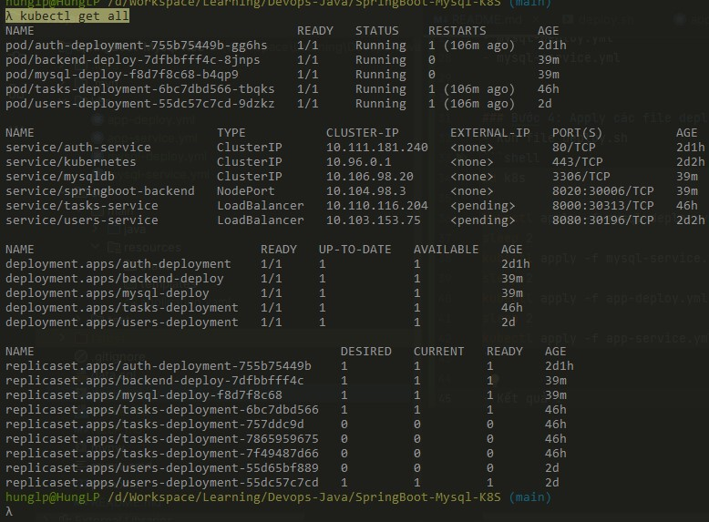
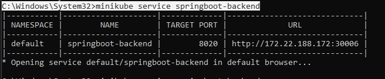
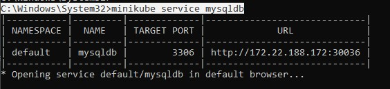
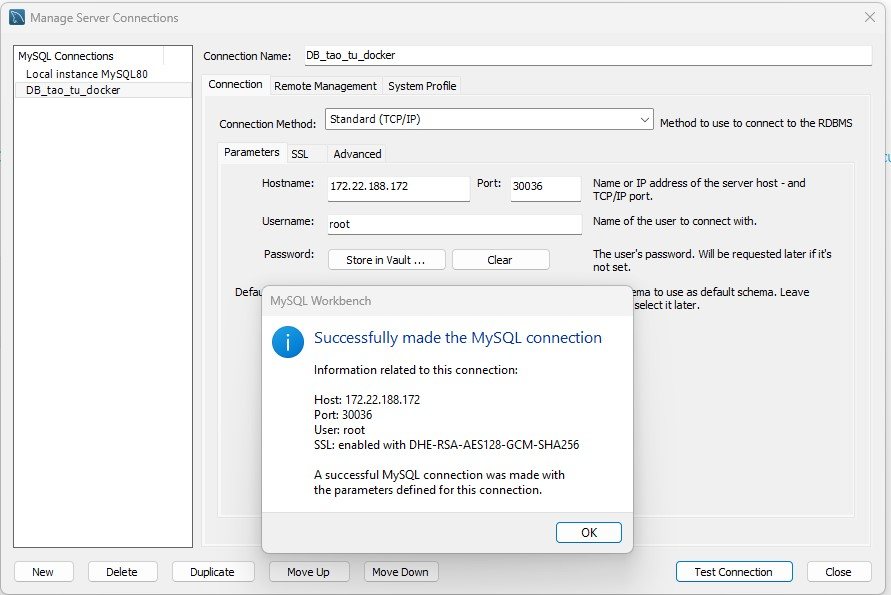
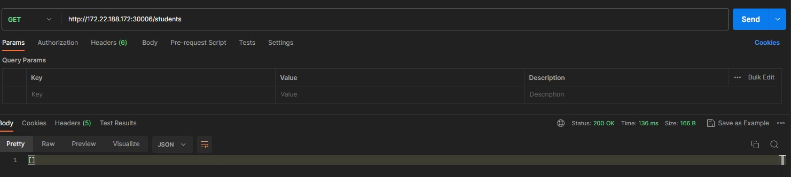

# Deploy project SpringBoot Mysql cơ bản sử dụng K8S


### Bước 0: Compile Project:
- Unix : `./mvnw clean install -DskipTests`
- Windows : `mvnw.cmd clean install -DskipTests`


### Bước 1: Tạo Dockerfile
```dockerfile
FROM adoptopenjdk/openjdk11:alpine-jre
ADD target/SpringBoot-Mysql-K8S-0.0.1-SNAPSHOT.jar app.jar
EXPOSE 8083
ENTRYPOINT ["java", "-jar", "app.jar"]
```


### Bước 2: Build images, push Dockerhub:
- Build : `docker build -t 123497/springboot-mysql-k8s .`
- Tạo repository _springboot-mysql-k8s_ trên Dockerhub
- Push lên docekr Hub : `docker push 123497/springboot-mysql-k8s`

### Bước 3: Tạo các file deployment/service 
- app.deploy.yml
- app-deploy.yml
- mysql-deploy.yml
- mysql-service.yml


### Bước 4: Apply các file deployment/service

(Lưu ý: Vì services mysql expose cổng 3306local. Do đó cần kill mysql ở máy local bằng lệnh sau : `net stop MySQL8` )
- Run file deploy.sh
```shell
cd k8s

kubectl apply -f mysql-deploy.yml
sleep 2
kubectl apply -f mysql-service.yml
sleep 2
kubectl apply -f app-deploy.yml
sleep 2
kubectl apply -f app-service.yml
```

- Kết quả : 
- 


### Bước 5 : Expose services: 
- `minikube service springboot-backend`
- `minikube service mysqldb`
- Kết quả: 
    + 
    + 
    + 
    + 

### Bước 6: Add volumes để lưu data mysql
